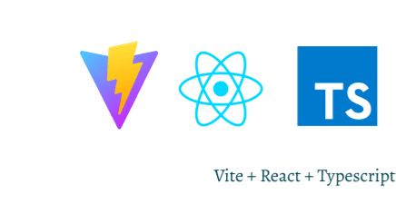

# Project Description  
A college-based Tech Incubator has established a vast network of tech startup entrepreneurs. These entrepreneurs face a constant stream of pressing tasks that must be addressed promptly. However, they can rely on the eagerness of college students to gain hands-on experience by completing these tasks. Create a web application that seamlessly facilitates this exchange of tasks.
<p align="center"></p>  

# Project Requirements  
1. The frontend must be in React + data must be stored in a cloud database.
2. There are only 2 user types: Employer and Student. Employers can create tasks whereas Students can pick up tasks.
3. Users must provide a name, but may also upload a profile picture, upon registration.  
4. Once a Student user type picks up a task, the user can set a status associated with that task (working, not working) and set an estimated time of completion (# of days). Once the user is done working on that task, the user enters a url and clicks ‘submit’ to complete the task.  

# Implementation Details  
The frontend uses React. Registration and login is made possible by Firebase Authentication. Firebase Storage maintains a record of all user files. All other user data is stored in Firestore database.  

In /-----, users can see open tasks. When a student successfully picks up a task, it's no longer viewable in /-----. Users can view their task history in /profile.  

# How to run  
``` 
npm run dev
```

# Languages  
Vite TypeScript React  
<p></p>